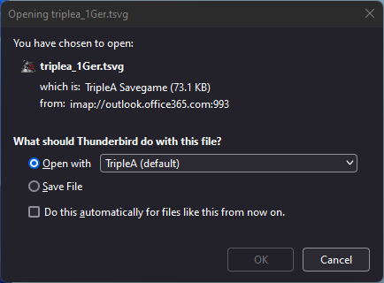
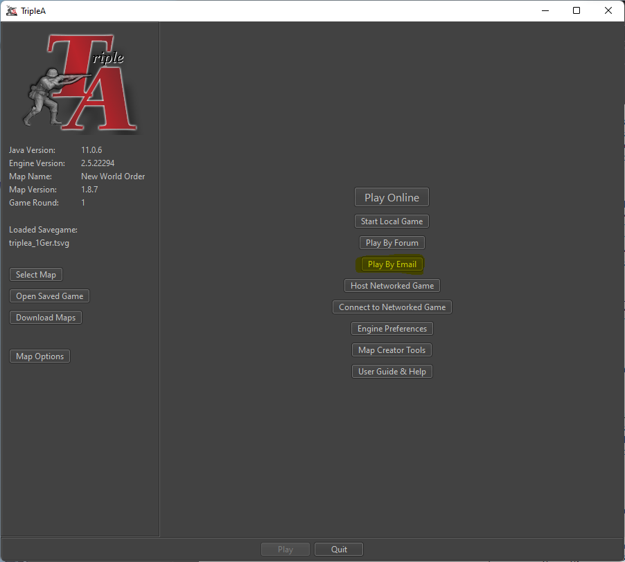
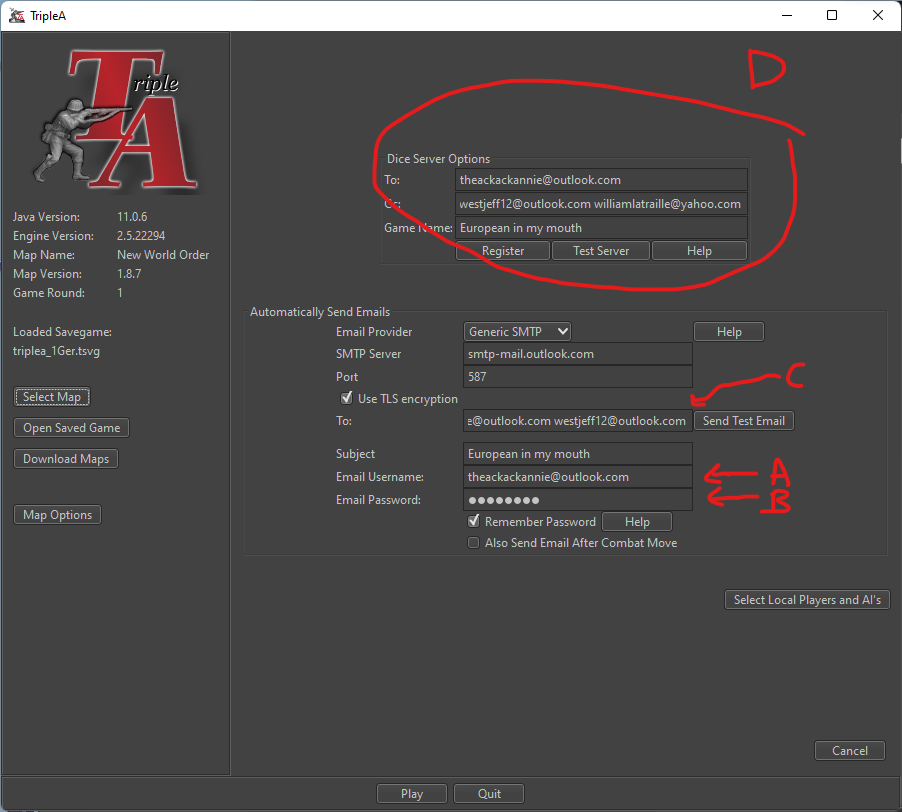
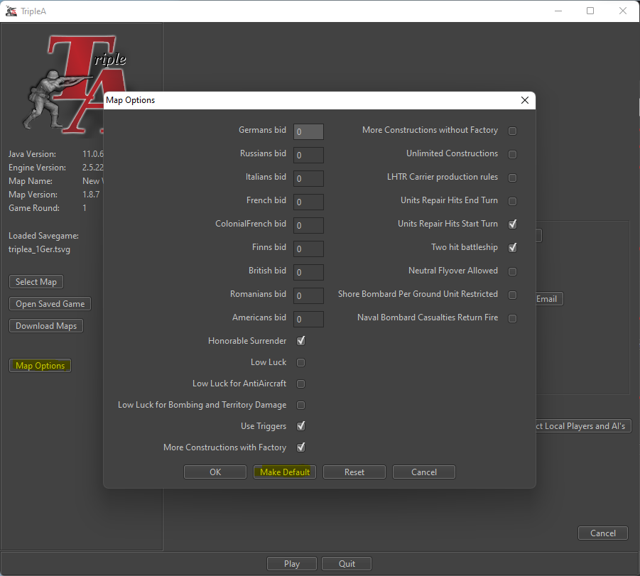
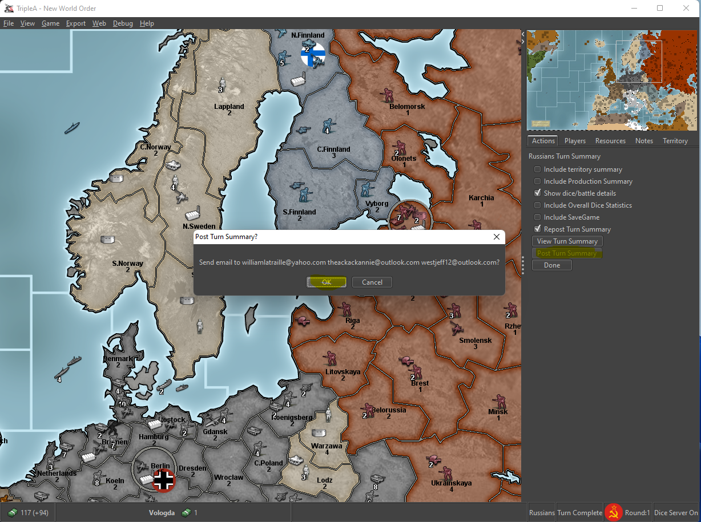

# triplea-howto
- [triplea-howto](#triplea-howto)
  - [Download and Launch](#download-and-launch)
    - [Configure e-mail settings](#configure-e-mail-settings)
    - [Configure Game Settings](#configure-game-settings)
  - [End Turn](#end-turn)

## Download and Launch

<figure>
    
    <figcaption>Download the e-mail attachment, ensure `Open with TripleA(default)` is selected, and click `ok`</figcaption>
</figure>
<figure>
    
    <figcaption>When TripleA launches, select `Play by Email`</figcaption>
</figure>

### Configure e-mail settings
<figure>
    
    <figcaption>
    A: your e-mail address here
    </figcaption>
    <figcaption>
    B: your email password here
    </figcaption>
    <figcaption>
    C: their (our) e-mail addresses here
    </figcaption>
    <figcaption>
    D: exactly as shown
    </figcaption>
</figure>

### Configure Game Settings
<figure>
    
    <figcaption>Select `Map Options` and configure exactly as shown and select `Make Default`</figcaption>
</figure>

## End Turn
<figure>
    
    <figcaption>Do your turn, then select `post turn summary` and then `ok`</figcaption>
</figure>
